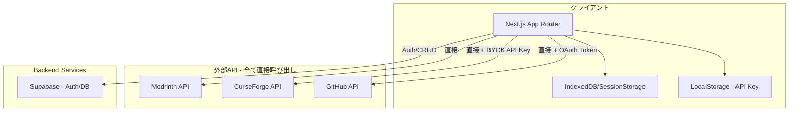
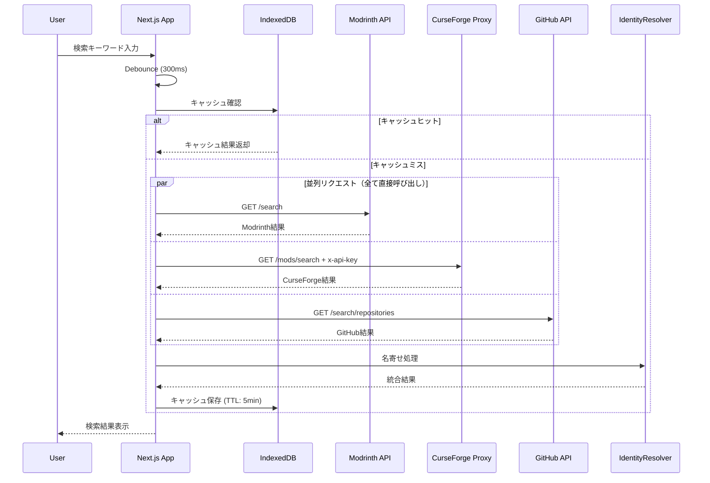
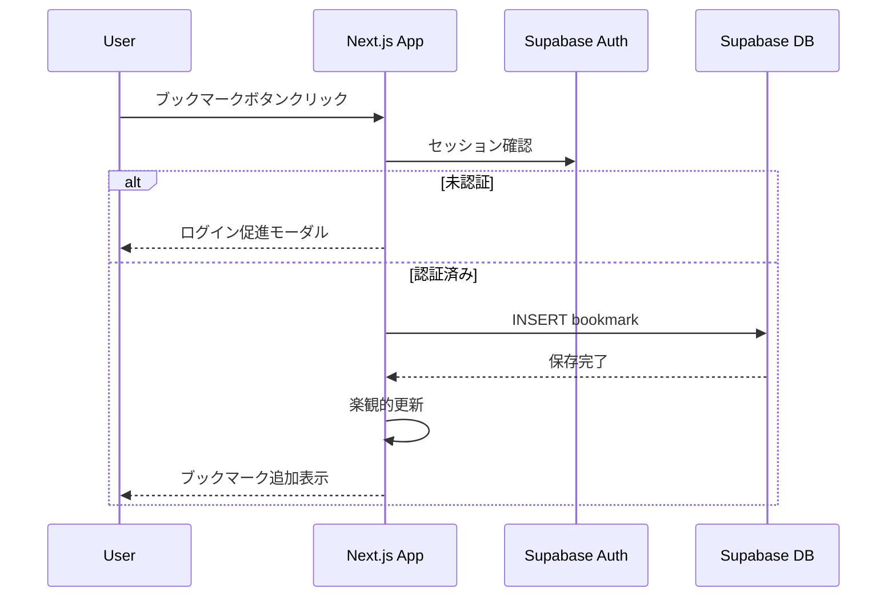
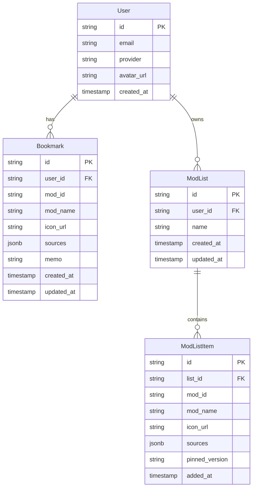

# Technical Design Document

## Overview

**Purpose**: Minecraft Mod横断検索プラットフォームは、複数のModプラットフォーム（Modrinth, CurseForge, GitHub）を一つのインターフェースから同時に検索し、検索結果の名寄せ・ブックマーク・Modリスト管理を提供する。

**Users**: Mod構成を頻繁に変更する中〜上級者、サーバー管理者、Modパック作成者（10〜20名規模のコミュニティ利用）

**Impact**: 分散したMod探しの手間を解消し、BYOK/OAuth方式でAPIレート制限を回避しながら、完全無料（Free Tier範囲内）で運用可能なプラットフォームを実現する。

### Goals
- 複数Modプラットフォームの横断検索と名寄せによる統合表示
- BYOK（Bring Your Own Key）方式によるCurseForge連携
- GitHub OAuth連携によるレート制限拡張とユーザーデータ同期
- 完全無料（Free Tier範囲内）での運用
- レスポンシブでモダンなUI（DaisyUI + Tailwind CSS）

### Non-Goals
- .mrpack形式エクスポート（将来拡張として検討）
- Mod自動インストール機能
- Modの依存関係自動解決
- 多言語対応（初期リリースでは日本語のみ）
- モバイルアプリ（PWAで対応）

---

## Architecture

### Architecture Pattern & Boundary Map



**Architecture Integration**:
- **選定パターン**: Client-Heavy SPA Architecture
  - 検索・名寄せロジックはクライアントサイドで実行
  - **全APIがCORS対応のためプロキシ不要**
  - データ永続化はBaaS（Supabase）に委譲
- **ドメイン境界**:
  - **Search Domain**: 検索クエリ発行、結果取得、名寄せ
  - **User Domain**: 認証、ブックマーク、Modリスト管理
  - **Settings Domain**: API Key管理、テーマ設定
- **Steering準拠**: 完全無料運用、サーバーレス（プロキシなし）アーキテクチャ

### Technology Stack

| Layer | Choice / Version | Role in Feature | Notes |
|-------|------------------|-----------------|-------|
| Frontend | Next.js 14+ (App Router) | UI表示、検索ロジック | Bun runtime対応 |
| UI Framework | Tailwind CSS 3.4+ | スタイリング | ユーティリティファースト |
| UI Components | DaisyUI 4+ | コンポーネントライブラリ | Tailwind CSS上に構築 |
| Data Fetching | TanStack Query 5+ | キャッシュ管理、データフェッチ | staleTime/gcTimeで最適化 |
| Backend/BaaS | Supabase | Auth + PostgreSQL | Free Tier: 500MB |
| Runtime | Bun 1.x | パッケージ管理、ビルド | 要件指定 |
| Hosting | Vercel (Free Tier) | フロントエンドホスティング | Next.js最適化 |
| Language | TypeScript 5+ | 型安全性 | strict mode |

**Note**: 全外部API（Modrinth, CurseForge, GitHub）がCORS対応のため、プロキシサーバー不要。

---

## System Flows

### 検索フロー（マルチソース並列検索）



**Key Decisions**:
- 各APIリクエストは `Promise.allSettled` で並列実行
- 先に返った結果から順次表示（Progressive Loading）
- 名寄せはSlug完全一致 + GitHubリンク照合の2段階

### ブックマーク保存フロー



---

## Requirements Traceability

| Requirement | Summary | Components | Interfaces | Flows |
|-------------|---------|------------|------------|-------|
| 1.1-1.6 | マルチソース検索 | SearchService, ModrinthAdapter, CurseForgeAdapter, GitHubAdapter | SearchService | 検索フロー |
| 2.1-2.3 | 名寄せ | IdentityResolver | IdentityResolver | 検索フロー |
| 3.1-3.4 | フィルタリング | FilterService, FilterSidebar | FilterService | 検索フロー |
| 4.1-4.4 | ユーザー認証 | AuthService, AuthProvider | AuthService | 認証フロー |
| 5.1-5.5 | ブックマーク | BookmarkService, BookmarkRepository | BookmarkService | ブックマークフロー |
| 6.1-6.5 | Modリスト | ModListService, ModListRepository | ModListService | リスト管理フロー |
| 7.1-7.5 | API設定管理 | VaultService, SettingsPage | VaultService | 設定フロー |
| 8.1-8.3 | エクスポート | ExportService | ExportService | エクスポートフロー |
| 9.1-9.4 | キャッシュ | CacheService | CacheService | 検索フロー |
| 10.1-10.2 | ホーム画面 | HomePage, SearchBar | - | - |
| 11.1-11.4 | 検索結果画面 | SearchResultsPage, ModCard | - | - |
| 12.1-12.2 | マイライブラリ | LibraryPage | - | - |
| 13.1-13.2 | 設定画面 | SettingsPage | - | - |
| 14.1-14.3 | セキュリティ | VaultService | - | - |
| 15.1-15.2 | パフォーマンス | SearchService | - | 検索フロー |
| 16.1-16.3 | コスト制約 | 全コンポーネント | - | - |

---

## Components and Interfaces

### Component Summary

| Component | Domain/Layer | Intent | Req Coverage | Key Dependencies | Contracts |
|-----------|--------------|--------|--------------|------------------|-----------|
| SearchService | Search/Service | 複数API検索の統合管理 | 1.1-1.6, 15.1-15.2 | ModrinthAdapter, CurseForgeAdapter, GitHubAdapter (P0) | Service, State |
| IdentityResolver | Search/Service | 検索結果の名寄せ | 2.1-2.3 | - (P2) | Service |
| FilterService | Search/Service | フィルタリングロジック | 3.1-3.4 | - (P2) | Service, State |
| CacheService | Infra/Service | キャッシュ管理 | 9.1-9.4 | IndexedDB (P1) | Service |
| AuthService | User/Service | 認証管理 | 4.1-4.4 | Supabase Auth (P0) | Service, State |
| BookmarkService | User/Service | ブックマーク管理 | 5.1-5.5 | BookmarkRepository (P0) | Service |
| ModListService | User/Service | Modリスト管理 | 6.1-6.5 | ModListRepository (P0) | Service |
| VaultService | Settings/Service | API Key暗号化管理 | 7.1-7.5, 14.1-14.3 | Web Crypto API (P0) | Service |
| ExportService | Utility/Service | エクスポート処理 | 8.1-8.3 | - (P2) | Service |

### Search Domain

#### SearchService

| Field | Detail |
|-------|--------|
| Intent | 複数Modプラットフォームへの検索リクエスト発行と結果統合 |
| Requirements | 1.1, 1.2, 1.3, 1.4, 1.5, 1.6, 15.1, 15.2 |

**Responsibilities & Constraints**
- 検索キーワードに対するDebounce処理（300ms）
- 各Adapter経由での並列API呼び出し
- 検索結果のIdentityResolverへの受け渡し
- Progressive Loading（先着結果から順次返却）

**Dependencies**
- Outbound: ModrinthAdapter — Modrinth API呼び出し (P0)
- Outbound: CurseForgeAdapter — CurseForge API呼び出し (P1)
- Outbound: GitHubAdapter — GitHub API呼び出し (P1)
- Outbound: IdentityResolver — 名寄せ処理 (P0)
- Outbound: CacheService — キャッシュ読み書き (P1)

**Contracts**: Service [x] / State [x]

##### Service Interface
```typescript
interface SearchService {
  search(params: SearchParams): Promise<SearchResult>;
  searchWithCache(params: SearchParams): Promise<SearchResult>;
}

interface SearchParams {
  query: string;
  minecraftVersion?: string;
  loader?: ModLoader;
  sources: ModSource[];
}

type ModLoader = 'fabric' | 'forge' | 'neoforge' | 'quilt';
type ModSource = 'modrinth' | 'curseforge' | 'github';

interface SearchResult {
  mods: UnifiedMod[];
  sourceStatus: Record<ModSource, SourceStatus>;
  fromCache: boolean;
}

interface SourceStatus {
  success: boolean;
  error?: string;
  resultCount: number;
}
```

##### State Management
- **State model**: TanStack Queryによるサーバーステート管理
- **Persistence**: IndexedDB永続化（TTL: 5分）
- **Concurrency**: 同一クエリの重複リクエスト防止（deduplication）

#### IdentityResolver

| Field | Detail |
|-------|--------|
| Intent | 複数ソースの検索結果を同一Modとして統合 |
| Requirements | 2.1, 2.2, 2.3 |

**Responsibilities & Constraints**
- Slug完全一致による統合
- GitHubリンク照合による統合
- 統合不可の結果は個別Modとして保持

**Dependencies**
- Inbound: SearchService — 名寄せリクエスト (P0)

**Contracts**: Service [x]

##### Service Interface
```typescript
interface IdentityResolver {
  resolve(results: SourceResults): UnifiedMod[];
}

interface SourceResults {
  modrinth: ModrinthMod[];
  curseforge: CurseForgeMod[];
  github: GitHubRepo[];
}

interface UnifiedMod {
  id: string; // 生成されたユニークID
  slug: string;
  name: string;
  description: string;
  iconUrl?: string;
  sources: ModSourceInfo[];
  versions: string[];
  loaders: ModLoader[];
  downloads: number;
  updatedAt: string;
}

interface ModSourceInfo {
  source: ModSource;
  url: string;
  id: string; // 各ソース固有のID
}
```

#### API Adapters

##### ModrinthAdapter
```typescript
interface ModrinthAdapter {
  search(params: ModrinthSearchParams): Promise<ModrinthSearchResult>;
}

interface ModrinthSearchParams {
  query: string;
  facets?: string[][]; // [["versions:1.20.1"], ["categories:fabric"]]
  index?: 'relevance' | 'downloads' | 'follows' | 'newest' | 'updated';
  offset?: number;
  limit?: number;
}
```

##### CurseForgeAdapter
```typescript
interface CurseForgeAdapter {
  search(params: CurseForgeSearchParams, apiKey: string): Promise<CurseForgeSearchResult>;
}

interface CurseForgeSearchParams {
  searchFilter: string;
  gameVersion?: string;
  modLoaderType?: 1 | 4 | 5 | 6; // Forge | Fabric | Quilt | NeoForge
  pageSize?: number;
  index?: number;
}
```

##### GitHubAdapter
```typescript
interface GitHubAdapter {
  searchRepositories(params: GitHubSearchParams, token?: string): Promise<GitHubSearchResult>;
}

interface GitHubSearchParams {
  query: string;
  sort?: 'stars' | 'forks' | 'updated';
  perPage?: number;
  page?: number;
}
```

### User Domain

#### AuthService

| Field | Detail |
|-------|--------|
| Intent | Supabase Authを利用したユーザー認証管理 |
| Requirements | 4.1, 4.2, 4.3, 4.4 |

**Responsibilities & Constraints**
- GitHub OAuth認証フロー
- Email/Password認証
- セッション管理（長期保持）
- GitHub Access Tokenの取得（GitHub API用）

**Dependencies**
- External: Supabase Auth — 認証プロバイダー (P0)

**Contracts**: Service [x] / State [x]

##### Service Interface
```typescript
interface AuthService {
  signInWithGitHub(): Promise<AuthResult>;
  signInWithEmail(email: string, password: string): Promise<AuthResult>;
  signUp(email: string, password: string): Promise<AuthResult>;
  signOut(): Promise<void>;
  getSession(): Promise<Session | null>;
  getGitHubToken(): Promise<string | null>;
  onAuthStateChange(callback: AuthStateCallback): Unsubscribe;
}

interface AuthResult {
  success: boolean;
  user?: User;
  error?: AuthError;
}

interface User {
  id: string;
  email?: string;
  provider: 'github' | 'email';
  avatarUrl?: string;
}
```

#### BookmarkService

| Field | Detail |
|-------|--------|
| Intent | ブックマークのCRUD操作 |
| Requirements | 5.1, 5.2, 5.3, 5.4, 5.5 |

**Responsibilities & Constraints**
- 楽観的更新によるUX向上
- ユーザーごとのデータ分離（RLS）

**Dependencies**
- External: Supabase Database — データ永続化 (P0)
- Inbound: AuthService — ユーザーID取得 (P0)

**Contracts**: Service [x]

##### Service Interface
```typescript
interface BookmarkService {
  getAll(): Promise<Bookmark[]>;
  add(mod: UnifiedMod, memo?: string): Promise<Bookmark>;
  update(id: string, memo: string): Promise<Bookmark>;
  remove(id: string): Promise<void>;
  isBookmarked(modId: string): boolean;
}

interface Bookmark {
  id: string;
  userId: string;
  modId: string;
  modName: string;
  iconUrl?: string;
  sources: ModSourceInfo[];
  memo?: string;
  createdAt: string;
  updatedAt: string;
}
```

#### ModListService

| Field | Detail |
|-------|--------|
| Intent | Modリストの作成・管理 |
| Requirements | 6.1, 6.2, 6.3, 6.4, 6.5 |

**Dependencies**
- External: Supabase Database — データ永続化 (P0)

**Contracts**: Service [x]

##### Service Interface
```typescript
interface ModListService {
  getLists(): Promise<ModList[]>;
  getList(id: string): Promise<ModList>;
  createList(name: string): Promise<ModList>;
  deleteList(id: string): Promise<void>;
  addMod(listId: string, mod: UnifiedMod, pinnedVersion?: string): Promise<ModListItem>;
  removeMod(listId: string, itemId: string): Promise<void>;
  updatePinnedVersion(itemId: string, version: string): Promise<ModListItem>;
}

interface ModList {
  id: string;
  userId: string;
  name: string;
  items: ModListItem[];
  createdAt: string;
  updatedAt: string;
}

interface ModListItem {
  id: string;
  listId: string;
  modId: string;
  modName: string;
  iconUrl?: string;
  sources: ModSourceInfo[];
  pinnedVersion?: string;
  addedAt: string;
}
```

### Settings Domain

#### VaultService

| Field | Detail |
|-------|--------|
| Intent | API Keyの暗号化保存・取得 |
| Requirements | 7.1, 7.2, 7.3, 7.4, 7.5, 14.1 |

**Responsibilities & Constraints**
- Web Crypto APIによるAES-GCM暗号化
- LocalStorageに暗号化保存
- デバイス固有のsaltを使用
- **サーバーには一切送信しない**（CurseForge APIはCORS対応）

**Dependencies**
- External: Web Crypto API — 暗号化 (P0)
- External: LocalStorage — 永続化 (P0)

**Contracts**: Service [x]

##### Service Interface
```typescript
interface VaultService {
  setCurseForgeApiKey(apiKey: string): Promise<void>;
  getCurseForgeApiKey(): Promise<string | null>;
  removeCurseForgeApiKey(): Promise<void>;
  hasCurseForgeApiKey(): boolean;
}
```

**Implementation Notes**
- 暗号化キーはデバイスフィンガープリント + ユーザー入力のPIN（オプション）から導出
- LocalStorage内でのカジュアルな漏洩を防止
- CurseForge APIはCORS対応のため、APIキーはブラウザ内で完結（真のBYOK）

### Infra Domain

#### CacheService

| Field | Detail |
|-------|--------|
| Intent | 検索結果のブラウザキャッシュ管理 |
| Requirements | 9.1, 9.2, 9.3 |

**Contracts**: Service [x]

##### Service Interface
```typescript
interface CacheService {
  get<T>(key: string): Promise<T | null>;
  set<T>(key: string, value: T, ttlMs?: number): Promise<void>;
  has(key: string): Promise<boolean>;
  remove(key: string): Promise<void>;
  clear(): Promise<void>;
}
```

**Implementation Notes**
- TanStack Queryの永続化プラグインとしてIndexedDBを使用
- デフォルトTTL: 5分

### Utility Domain

#### ExportService

| Field | Detail |
|-------|--------|
| Intent | Modリストのエクスポート |
| Requirements | 8.1, 8.2, 8.3 |

**Contracts**: Service [x]

##### Service Interface
```typescript
interface ExportService {
  toMarkdown(list: ModList): string;
  copyToClipboard(content: string): Promise<void>;
  downloadAsFile(content: string, filename: string): void;
}
```

---

## Data Models

### Domain Model



### Physical Data Model (Supabase PostgreSQL)

```sql
-- Users table (managed by Supabase Auth)
-- auth.users

-- Bookmarks table
CREATE TABLE bookmarks (
  id UUID PRIMARY KEY DEFAULT gen_random_uuid(),
  user_id UUID REFERENCES auth.users(id) ON DELETE CASCADE NOT NULL,
  mod_id TEXT NOT NULL,
  mod_name TEXT NOT NULL,
  icon_url TEXT,
  sources JSONB NOT NULL DEFAULT '[]',
  memo TEXT,
  created_at TIMESTAMPTZ DEFAULT NOW(),
  updated_at TIMESTAMPTZ DEFAULT NOW(),
  UNIQUE(user_id, mod_id)
);

-- Row Level Security
ALTER TABLE bookmarks ENABLE ROW LEVEL SECURITY;
CREATE POLICY "Users can CRUD own bookmarks" ON bookmarks
  FOR ALL USING (auth.uid() = user_id);

-- Mod Lists table
CREATE TABLE mod_lists (
  id UUID PRIMARY KEY DEFAULT gen_random_uuid(),
  user_id UUID REFERENCES auth.users(id) ON DELETE CASCADE NOT NULL,
  name TEXT NOT NULL,
  created_at TIMESTAMPTZ DEFAULT NOW(),
  updated_at TIMESTAMPTZ DEFAULT NOW()
);

ALTER TABLE mod_lists ENABLE ROW LEVEL SECURITY;
CREATE POLICY "Users can CRUD own lists" ON mod_lists
  FOR ALL USING (auth.uid() = user_id);

-- Mod List Items table
CREATE TABLE mod_list_items (
  id UUID PRIMARY KEY DEFAULT gen_random_uuid(),
  list_id UUID REFERENCES mod_lists(id) ON DELETE CASCADE NOT NULL,
  mod_id TEXT NOT NULL,
  mod_name TEXT NOT NULL,
  icon_url TEXT,
  sources JSONB NOT NULL DEFAULT '[]',
  pinned_version TEXT,
  added_at TIMESTAMPTZ DEFAULT NOW(),
  UNIQUE(list_id, mod_id)
);

ALTER TABLE mod_list_items ENABLE ROW LEVEL SECURITY;
CREATE POLICY "Users can CRUD items in own lists" ON mod_list_items
  FOR ALL USING (
    list_id IN (SELECT id FROM mod_lists WHERE user_id = auth.uid())
  );

-- Indexes
CREATE INDEX idx_bookmarks_user_id ON bookmarks(user_id);
CREATE INDEX idx_mod_lists_user_id ON mod_lists(user_id);
CREATE INDEX idx_mod_list_items_list_id ON mod_list_items(list_id);
```

---

## Error Handling

### Error Strategy
- ユーザーエラー: フィールドレベルバリデーション、トースト通知
- API エラー: 個別ソースの失敗は他ソースに影響させない（部分的成功）
- システムエラー: エラーバウンダリでキャッチ、リトライ促進

### Error Categories and Responses

| Category | Scenario | Response |
|----------|----------|----------|
| User Error | CurseForge API Key未設定 | インジケーターグレーアウト、設定画面への誘導 |
| User Error | 未認証でブックマーク操作 | ログイン促進モーダル |
| API Error | Modrinth API失敗 | 他ソース結果のみ表示、エラートースト |
| API Error | GitHub レート制限 | ログイン促進（OAuth推奨） |
| System Error | ネットワーク障害 | リトライボタン付きエラー画面 |

---

## Testing Strategy

### Unit Tests
- IdentityResolver: Slug一致、GitHubリンク照合、エッジケース
- VaultService: 暗号化/復号化、キー存在確認
- FilterService: バージョンフィルタ、ローダーフィルタ
- ExportService: Markdown生成フォーマット

### Integration Tests
- SearchService: 複数Adapter統合、キャッシュ動作
- BookmarkService: Supabase CRUD操作、RLS検証
- AuthService: OAuth フロー、セッション管理

### E2E Tests
- 検索→フィルタ→ブックマーク保存フロー
- ログイン→マイライブラリ表示→Modリスト作成フロー
- 設定画面→API Key入力→CurseForge検索有効化フロー

---

## Security Considerations

### API Key Protection (Req 14.1, 14.2)
- CurseForge API KeyはLocalStorageに暗号化保存
- **サーバーには一切送信しない**（CurseForge APIはCORS対応でクライアント直接呼び出し可能）
- 真のBYOKモデルを実現：APIキーはユーザーのブラウザ内で完結

### CORS Proxy Security (Req 14.3)
- **プロキシ不要**: 全外部API（Modrinth, CurseForge, GitHub）がCORS対応
- クライアントから直接呼び出し可能

### Data Protection
- Row Level Security (RLS) によるユーザーデータ分離
- HTTPSのみ通信

---

## Performance & Scalability

### Target Metrics
- 検索結果表示: 初回結果 < 1秒（キャッシュミス時）
- キャッシュヒット時: < 100ms
- インタラクション応答: < 100ms

### Optimization Strategies
- 並列API呼び出し（Promise.allSettled）
- Progressive Loading（先着結果から表示）
- Debounce（300ms）によるリクエスト削減
- TanStack Queryによるキャッシュ最適化
- IndexedDB永続化によるセッション間キャッシュ
